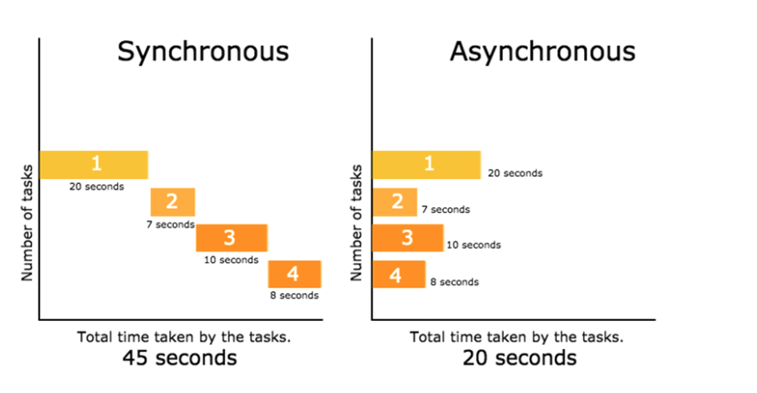

# odev-1
Ödev
1. JavaScript nedir ve tarihsel gelişiminden bahsedin
    
    "JavaScript, web tarayıcılarında kullanılan ve web sayfalarına etkileşim kazandıran, dinamik içerikler oluşturmak için kullanılan bir programlama dilidir. Brendan Eich tarafından Netscape Communications Corporation için geliştirilmeye başlanmıştır. İlk adı Mocha olan dil, daha sonra LiveScript olarak adlandırılmış ve son olarak da JavaScript adını almıştır."

2. Java ile javascript arasındaki fark nedir
    Java her platformda çalışan bir Object Oriented Programlama diliyken JavaScript Tarayıcılarda çalışan bir betik programlama dilidir.
3. Javascript teki veri tipleri nelerdir açıklayınız
    İlkel (Primitive) Veri Tipleri:
        String
        Number
        Boolean
        Null
        Undefined
    Referans Türler:
        Object
        Function

4. null ile undefined arasıdaki fark nedir açıklayınız
    ikisine de henüz değer atanmamışdır, Null'da bellek allocate edilirken Undefined'da bellek allocate edilmez.
    
5. NaN nedir açıklayınız
    Not a Number anlamına gelir.

6. Javascript’te yorum satırı eklemenin kaç farklı yolu vardır
    // ve /**/

7. Global değişken ne demektir açıklayınız
    Global scope'da tanımlanmış değişkendir.

8. Javascript’te this anahtar kelimesi nedir açıklayınız
    Mevcut bağlama işaret eder

9. == ile === farkını örnekler ile açıklayınız
    ==, sadece değerleri karşılaştırırken, === hem değerleri hem de veri tiplerini karşılaştırır. 
    Örnek olarak:
    • 5 == '5' true döner çünkü sadece değerler karşılaştırılır.
    • 5 === '5' false döner çünkü değerlerin ve tiplerin her ikisi de farklıdır.

10. let var const farkını tablo yapınız
    
11. Arrow fonksiyonun normal fonksiyondan farkları nelerdir
    Arrow fonksiyonları kısa bir syntax sunar ve this bağlamını değiştirmez. Normal fonksiyonlar (function ifadesi) kendi this bağlamını oluştururken, arrow fonksiyonları mevcut this bağlamını kullanır.

12. swich bloğu içinde hatasız nasıl değişken tanımlanır
    Switch bloğu içinde değişken tanımlamak için let veya const kullanılabilir. Ancak, blok kapsamı nedeniyle bu değişkenler sadece kendi bloklarında erişilebilir olacaktır.

13. Pure fonksiyon ne demektir açıklayınız
    kapsamı dışından sadece parametre ile veri alan fonksiyonlardır.

14. Rest operatör nedir örnekle açıklayınız
    Rest operatörü ... ile temsil edilir. Fonksiyonlarda, değişken sayıda parametre almak için kullanılır. Bu operatör, gelen tüm parametreleri bir diziye toplar.
15. Object destructuring nedir örnekle açıklayınız
    Nesne destructuring'i, bir nesnenin özelliklerini ayrıştırmak ve değişkenlere atamak için kullanılır. Özelliklerin adını kullanarak nesne içindeki değerlere erişmeyi kolaylaştırır.
    ```javascript
    const person = { name: 'John', age: 30 };
    const { name, age } = person;
    console.log(name); // 'John'
    console.log(age); // 30
    ```

16. 2 elemanlı bir objeyi 6 farklı şekilde oluşturunuz
17. 2 elemanlı bir objenin key ve value değerlerinin karakter sayısı ile 2 farklı döngü methodu kullanarak yeni bir obje oluşturunuz
    ```javascript
    let yeniObje = {};

    for (let key in obje) {
    let value = obje[key];
    yeniObje[key.length] = value.toString().length;
    }

    console.log(yeniObje);
    ```

    ```javascript
    let yeniObje = {};

    Object.keys(obje).forEach(key => {
        yeniObje[key.length] = obje[key].toString().length;
    });

    console.log(yeniObje);
    ```


18. Cookie, local storage ve session storage farkını tablo yapınız
19. asenkron ve senkron işlem farkı nedir
    Senkron işlemler, sıralı ve adım adım gerçekleşen işlemlerdir. Asenkron işlemler ise işlemleri ardışık bir şekilde beklemek yerine eşzamanlı olarak gerçekleştirmeyi sağlar. Asenkron işlemlerde işlem tamamlanana kadar diğer işlemler devam edebilir.
    
20. promise nedir ve neden ihtiyaç duyarız
    Promise, asenkron işlemleri yönetmek için kullanılan bir JavaScript nesnesidir. Promise'ler, gelecekte bir değer dönecek bir işlemin tamamlanmasını temsil eder. Çoklu asenkron işlemleri daha okunabilir ve yönetilebilir hale getirmek için kullanılırlar. Özellikle API çağrıları, dosya okuma/yazma gibi işlemlerde yaygın olarak kullanılırlar.
    
Array Soruları
Ödev 2
var dolap = ["Shirt", "Pant","TShirt"];

1. dolap arrayindeki son elemanı silip consola yazdırın
    ```javascript
    var dolap = ["Shirt", "Pant","TShirt"];
    console.log(dolap.pop());
    ```

2. dolap arrayindeki ilk elamanı silip yerine “Hat” elemanını gönderip consola yazdırın
    ```javascript
    var dolap = ["Shirt", "Pant","TShirt"];
    dolap[0] = 'Hat';
    console.log(dolap);
    ```
3. dolap değişkeninin array olup olmadığını kontrol edin ve sonucu bir değişkene
eşitleyin

    ```javascript
        var dolap = ["Shirt", "Pant","TShirt"];
        let isArray = Array.isArray(dolap); // true ? false
    ```

4. dolap arrayinde “Pant” elemanın olup olmadığını 3 farklı method ile kontrol edin

    ```javascript
    var dolap = ["Shirt", "Pant","TShirt"];
    dolap.includes("Pant");
    ```

    ```javascript
    var dolap = ["Shirt", "Pant", "TShirt"];
    let pantIndex = dolap.indexOf("Pant");
    let pantVarMi = pantIndex !== -1; // Eğer -1 değilse true döner, aksi halde false
    console.log(pantVarMi); // true veya false değeri döner
    ```

    ```javascript
    var dolap = ["Shirt", "Pant", "TShirt"];
    let pantVarMi = dolap.find(item => item === "Pant");
    console.log(!!pantVarMi); // true veya false değeri döner
    ```


5. dolap arrayindeki elemanların karakter sayısını toplayıp geriye döndürecek
fonksiyonu yazın

    ```javascript
    function karakterSayisiTopla(dizi) {
        let toplamKarakterSayisi = 0;

        dizi.forEach(item => {
            toplamKarakterSayisi += item.length;
        });

        return toplamKarakterSayisi;
    }
    ```

6. dolap arrayindki tüm elemanları büyük harfe çevirip yeni bir değişkene 3 farklı
yöntemle atayın

    ```javascript
    var dolap = ["Shirt", "Pant", "TShirt"];
    let buyukHarfliDolap1 = dolap.map(item => item.toUpperCase());
    console.log(buyukHarfliDolap1); // ["SHIRT", "PANT", "TSHIRT"]
    ```

    ```javascript
    var dolap = ["Shirt", "Pant", "TShirt"];
    let buyukHarfliDolap2 = [];
    for (let i = 0; i < dolap.length; i++) {
        buyukHarfliDolap2.push(dolap[i].toUpperCase());
    }
    console.log(buyukHarfliDolap2); // ["SHIRT", "PANT", "TSHIRT"]
    ```

    ```javascript
    var dolap = ["Shirt", "Pant", "TShirt"];
    let buyukHarfliDolap3 = [];
    dolap.forEach(item => {
        buyukHarfliDolap3.push(item.toUpperCase());
    });
    console.log(buyukHarfliDolap3);
    ```

7. dolap arrayini index sayıları key olacak şekilde objeye çeviriniz

    ```javascript
    var dolap = ["Shirt", "Pant", "TShirt"];
    let objeForEach = {};
    dolap.forEach((item, index) => {
        objeForEach[index] = item;
    });
    console.log(objeForEach);
    ```

8. slice ile splice farkı nedir

    slice() yeni bir dizi oluştururken, splice() mevcut diziyi değiştirir.

    slice() sadece belli bir kısmı kopyalar, splice() ise diziden elemanları çıkarabilir veya ekleyebilir.

    slice() kullanıldığında orijinal dizi değişmez, splice() kullanıldığında orijinal dizi değişir ve silinen/eklenen elemanları içerir.

    slice()'ın geri döndürdüğü değer, kopyalanan kısmı içeren yeni bir dizi iken, splice() geri döndürdüğü değer silinen elemanları içeren bir dizidir.

const arr = [1,2,3,4,5,6,7,7,8,6,10];
1. arrayindeki yinelenen sayıları bulun

    ```javascript
    const arr = [1, 2, 3, 4, 5, 6, 7, 7, 8, 6, 10];
    const tekrarEdenler = {};

    for (let i = 0; i < arr.length; i++) {
        if (tekrarEdenler[arr[i]] === undefined) {
            tekrarEdenler[arr[i]] = 1;
        } else {
            tekrarEdenler[arr[i]]++;
        }
    }

    for (let key in tekrarEdenler) {
        if (tekrarEdenler[key] > 1) {
            console.log(`${key} sayısı ${tekrarEdenler[key]} kere tekrar ediyor.`);
        }
    }

    ```

2. arrayindeki tüm yinelenen sayıları silip yeni bir arrayi 2 farklı method ile oluşturun

    ```javascript
    const arr = [1, 2, 3, 4, 5, 6, 7, 7, 8, 6, 10];
    const uniqueArr = [...new Set(arr)];
    console.log(uniqueArr);
    ```

3. arrayindeki en yüksek ve en düşük değeri 2 farklı methodla bulun

    ```javascript
        

        const enBuyukDeger = Math.max(...arr);
        const enKucukDeger = Math.min(...arr);

        console.log("En büyük değer:", enBuyukDeger);
        console.log("En küçük değer:", enKucukDeger);
    ```

    ```javascript
        
        let enBuyukDeger = arr[0];
        let enKucukDeger = arr[0];
        for(let i in arr) {
            if(i > enBuyukDeger) enBuyukDeger = i;
            else if(i < enKucukDeger) enKucukDeger = i;
        }
        console.log("En büyük değer:", enBuyukDeger);
        console.log("En küçük değer:", enKucukDeger);
    ```

// Bu kodun çıktısı nedir neden ?

```javascript

function job() {
    return new Promise(function(resolve, reject) {
        reject();
    });
}

let promise = job();

promise.then(function() {
    console.log('Success 1');
}).then(function() {
    console.log('Success 2');
})
.then(function() {
    console.log('Success 3');
})
.catch(function() {
    console.log('Error 1');
}).then(function() {
    console.log('Success 4');
});

```

`Error 1
Success 4`

reject ile hata döndürülür ve dönen hata catch bloğunda yakalanır.

// Bu kodun çıktısı nedir neden ?

```javascript
function job(state) {
    return new Promise(function(resolve, reject) {
        if (state) {
            resolve('success');
        } else {
            reject('error');
        }
    });
}
let promise = job(true);
promise
    .then(function(data) {
        console.log(data);
        return job(true);
    })
    .then(function(data) {
        if (data !== 'victory') {
            throw 'Defeat';
        }
        return job(true);
    })
    .then(function(data) {
        console.log(data);
    })
    .catch(function(error) {
        console.log(error);
        return job(false);
    })
    .then(function(data) {
        Ödev 4
        console.log(data);
        return job(true);
    })
    .catch(function(error) {
        console.log(error);
        return 'Error caught';
    })
    .then(function(data) {
        console.log(data);
        return new Error('test');
    })
    .then(function(data) {
        console.log('Success:'
        , data.message);
    })
    .catch(function(data) {
        console.log('Error:'
        , data.message);
    }
```

1. Başlangıçta `job()` fonksiyonu `true` ile çağrılıyor, dolayısıyla bir `resolve` durumu oluşuyor.
2. İlk `then()` bloğu çalışıyor ve 'success' mesajını gösteriyor. Ardından, yeni bir `job(true)` fonksiyonu çağrılıyor.
3. İkinci `then()` bloğu, `data` değeri 'victory' olmadığını kontrol ediyor. Bu durumda bir hata (`throw 'Defeat'`) fırlatıyor ve zincir kesiliyor. Yani, bu kısım çalıştırılmadan zincir `catch()` bloğuna geçiyor.
4. `catch()` bloğu, 'Defeat' hatasını yakalıyor ve 'Defeat' mesajını gösteriyor. Ardından `job(false)` fonksiyonu çağrılıyor.
5. `job(false)` fonksiyonu reddedilmiş bir Promise döndürüyor, bu nedenle sonraki `then()` bloğu çalışmıyor, doğrudan bir `catch()` bloğuna geçiliyor.
6. İkinci `catch()` bloğu, reddedilmiş Promise'den gelen 'error' mesajını gösteriyor ve ardından 'Error caught' mesajı döndürüyor.
7. Yeni bir `then()` bloğuyla devam ediliyor, ancak öncesindeki işlemler reddedilmiş bir Promise döndürdüğü için `then()` bloğu çalışmıyor. Direkt olarak bir `catch()` bloğuna geçiliyor.
8. Yeni bir `catch()` bloğu, bir `Error` nesnesi döndürüyor, bu nedenle `then()` bloğu çalışmıyor ve bir sonraki `catch()` bloğuna geçiliyor.
9. Son `catch()` bloğu, yakalanan `Error` nesnesinin mesajını gösteriyor.
